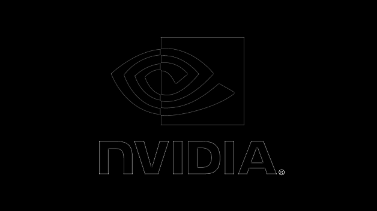

# [Cross-correlation][cross-correlation] using [cuDNN][cuDNN]

This is a C/C++ example of batched 2D cross-correlation using cuDNN.
- It takes a 4D input tensor with shape [batch size, depth, input tensor height, input tensor width].
  For example, a single (batch size is 1) RGB (depth is 3) image.
  
- It also takes a 4D filter with shape [output depth, input depth = tensor depth, filter height, filter width].
  For example, a single (output depth is 1) RGB (input depth is 3, but all 3 are the same) [edge detection filter][Kernel].
  
- It cross-correlates the input tensor and the filter and output a tensor with shape [batch size, output depth, output tensor height, output tensor width].
  

[cross-correlation]: https://en.wikipedia.org/wiki/Cross-correlation
[cuDNN]: https://docs.nvidia.com/deeplearning/cudnn/
[Kernel]: https://en.wikipedia.org/wiki/Kernel_(image_processing)


## Preparation

1. [Install NVIDIA cudart][install-cuda].
   - cudart is a part of the *CUDA Toolkit*.
   - Tested using cudart version 10.2.

2. [Install NVIDIA cuDNN][install-cudnn].
   - Tested using cuDNN version 8.0.

2. [Install OpenCV][install-opencv].

[install-cuda]: https://docs.nvidia.com/cuda/cuda-installation-guide-linux/index.html
[install-cudnn]: https://docs.nvidia.com/deeplearning/cudnn/install-guide/index.html#install-linux
[install-opencv]: https://docs.opencv.org/4.x/d7/d9f/tutorial_linux_install.html


## Installation

```
mkdir build
cd build
cmake ..
make
```

## Usage

### Example

```
$ cd Example
$ ./Example 
Load an image from input.png.
Create the input tensor.
Copy the image into the input tensor.
The input tensor shape is [1, 354, 630, 3].
Create the filter.
The filter shape is [1, 3, 3, 3].
Create edge detection kernel data.
Copy the kernel data into the filter.
Create the output tensor.
The output tensor shape [1, 352, 628, 1].
Cross-correlate the input tensor and the filter.
Save the output tensor as an image to output.png.
```

### Measure Speed

```
$ cd MeasureSpeed
$ ./MeasureSpeed
Create input tensor with shape [1, 1, 128, 128] and random data.
Create filter with shape [512, 1, 16, 16] and random data.
Cross-correlation takes 27.2 ms.
```

- Tested on the device [Jetson Nano Developer][jetson-nano-developer-kit] running OS [L4T 32.4.4][linux-tegra].

[jetson-nano-developer-kit]: https://developer.nvidia.com/embedded/jetson-nano-developer-kit
[linux-tegra]: https://developer.nvidia.com/embedded/linux-tegra-r3244
